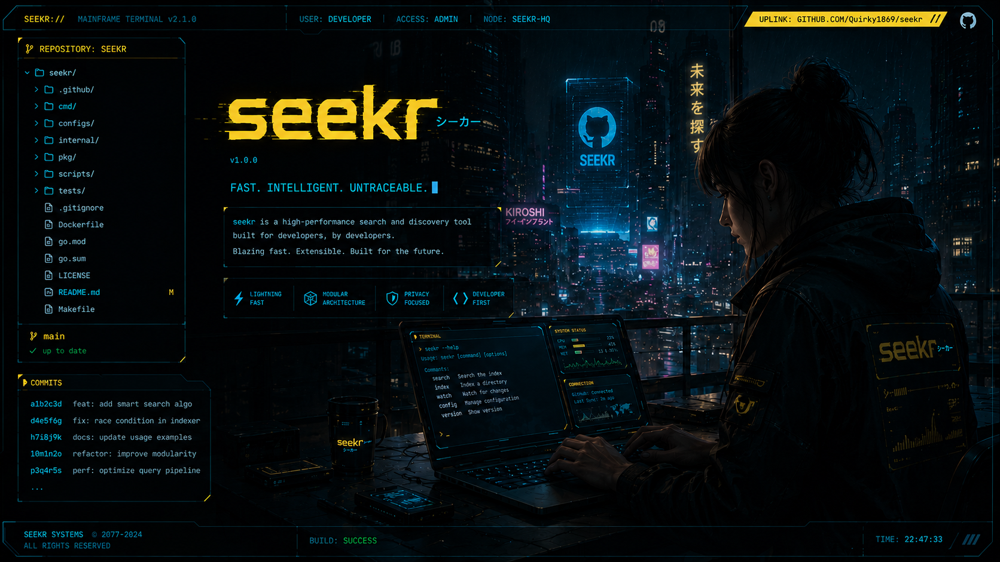

# seekr

  

# SEEKR

SEEKR is a lightweight, ultra-fast, and elegant Terminal User Interface (TUI) written in Go with Bubble Tea to wrap the `find` command. It transforms complex shell search parameters into a modular, interactive, and bilingual dashboard  

## Features

* **Tabbed Interface:** Seamless navigation between basic options, filters, advanced flags, and results  
* **Real-Time Command Generation:** Instantly copy the exact syntax of the generated `find` command  
* **Bilingual Support:** Switch on the fly between English (EN) and French (FR) with a simple keyboard shortcut  
* **Result Navigation:** Easily browse through long lists of files thanks to a dedicated Viewport  

## Keyboard Shortcuts

* `F1` / `F2` / `F3` / `F4`: Direct tab switching
* `Tab`: Move sequentially from one tab to another
* `↑` / `↓`: Navigate through input fields or scroll through results
* `Enter`: Cycle through selectors (File Types) or toggle options (ON/OFF)
* `F5`: Execute the `find` search and switch to the **Results** tab
* `F6`: Copy the generated command to the clipboard
* `F7`: Reset the results and current status
* `Ctrl + L`: Dynamically change the application language (EN ↔ FR)
* `Ctrl + C` / `q`: Quit the application (`q` works when no text field is focused)

## Copying results with the mouse

> [!CAUTION]  
> Since SEEKR natively captures mouse events to enable scrolling and interactivity, your terminal's standard highlighting is blocked
> To select and copy a file path using the mouse with a keyboard modifier:
>  
> Hold down the **Shift** key while selecting the text with your mouse, then use the shortcut **Ctrl + Shift + C**

## Quick Start

### Prerequisites
* **Go:** 1.22 or higher
* **Operating System:** Linux

### Releases

Releases are available [here](https://github.com/Quirky1869/seekr/releases)  

*Developed with ❤️ by [Quirky](https://github.com/Quirky1869)*  

___  

# SEEKR

SEEKR est une interface utilisateur de terminal (TUI) légère, ultra-rapide et élégante écrite en Go avec Bubble Tea pour encapsuler la commande `find`. Elle transforme les paramètres complexes de recherche shell en un tableau de bord modulaire, interactif et bilingue.  

## Fonctionnalités

* **Interface par Onglets :** Navigation fluide entre les options de base, les filtres, les drapeaux avancés et les résultats.
* **Génération de Commande en Temps Réel :** Copiez instantanément la syntaxe exacte de la commande `find` générée.
* **Support Bilingue :** Basculez à la volée entre l'anglais (EN) et le français (FR) d'un simple raccourci clavier.
* **Navigation dans les Résultats :** Parcourez facilement les longues listes de fichiers grâce à un Viewport dédié.

## Raccourcis Clavier

* `F1` / `F2` / `F3` / `F4` : Changement direct d'onglet
* `Tab` : Passer d'un onglet à l'autre séquentiellement
* `↑` / `↓` : Naviguer parmi les champs de saisie ou faire défiler les résultats
* `Entrée` : Faire défiler les sélecteurs (Types de fichiers) ou basculer les options (ON/OFF)
* `F5` : Exécuter la recherche `find` et basculer sur l'onglet **Résultats**
* `F6` : Copier la commande générée dans le presse-papiers
* `F7` : Réinitialiser les résultats et le statut actuel
* `Ctrl + L` : Changer dynamiquement la langue de l'application (EN ↔ FR)
* `Ctrl + C` / `q` : Quitter l'application (`q` fonctionne lorsque aucun champ texte n'est sélectionné)

## Copier les résultats avec la souris

> [!CAUTION]  
> Comme SEEKR capture nativement les événements de la souris pour permettre le défilement et l'interactivité, le surlignage standard de votre terminal est bloqué
> Pour sélectionner et copier un chemin de fichier à la souris avec un raccourci clavier :
>  
> Maintenez la touche **Maj (Shift)** enfoncée tout en sélectionnant le texte avec la souris, puis utilisez le raccourci **Ctrl + Shift + C**

## Démarrage Rapide

### Prérequis
* **Go :** 1.22 ou supérieur
* **Système d'exploitation :** Linux

### Releases

Les [releases](https://github.com/Quirky1869/seekr/releases) sont disponibles [ici](https://github.com/Quirky1869/seekr/releases)  

*Développé avec ❤️ par [Quirky](https://github.com/Quirky1869)*  
